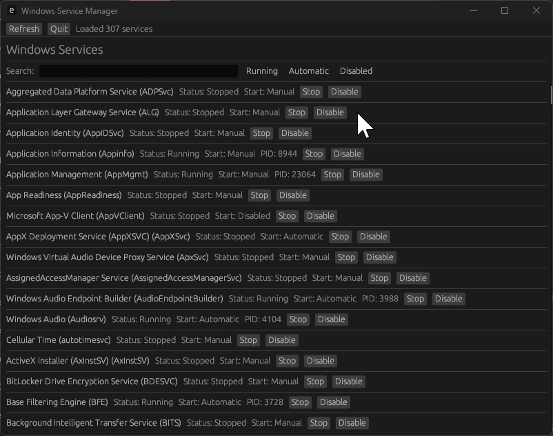

# Windows Service GUI

A small desktop tool for browsing and controlling Windows services with an egui-based interface. It lists services with their display name, status, start type, and process ID, and lets you stop or disable services directly.

## Screenshot


## Features
- Enumerates all Windows services via the Service Control Manager
- Fuzzy search by service name or display name
- Quick filters for running, automatic, and disabled services
- Stop or disable services with immediate refresh
- Copy a service name by right-clicking its row

## Requirements
- Windows 10/11
- Rust toolchain (edition 2024) with Cargo
- Visual Studio Build Tools (for the Windows SDK and linker)

## Build
```bash
cargo build --release
```
The optimized binary is written to `target/release/windows-service-gui.exe`.

## Run
Launch the built binary (or `cargo run`). The app relaunches itself with elevated permissions if needed so it can control services.

## Tag-based releases
Pushing a Git tag that starts with `v` (for example `v0.1.0`) triggers the GitHub Actions workflow in `.github/workflows/release.yml` to build the Windows binary and publish a GitHub Release with the artifact attached.

```bash
git tag v0.1.0
git push origin v0.1.0
```

## Project structure
- `src/main.rs` – egui application and service control logic
- `build.rs`, `app.rc`, `app.manifest` – Windows resource embedding
- `Cargo.toml` – crate metadata and dependencies
